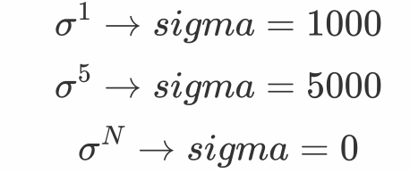
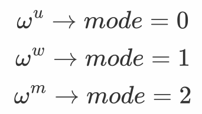

# GiBIDS: Graph Based Intrusion Detection System

## Preliminary infos
As stated in the related paper, we define **sigma** and **omega** parameters respectively for connections block dimension and for weights definition. Here we show the conversion from mathematical formulation to code variables names and values

For sigma
<div style="text-align: center">

</div>

For omega
<div style="text-align: center">

</div>


## Environment Setup
1) Create a new environment based on ``graph-tool`` library using **conda**: 
      ``` 
        conda create --name GIBIDS -c conda-forge graph-tool 
        conda activate GIBIDS
      ```
   (ref: https://graph-tool.skewed.de/)
2) Once the conda environment is installed, install through pip the following packages:
   - jupyter
   - matplotlib (3.7.2)
   - mlxtend (0.22.0)
   - networkx (3.1) [it's used just for graph sample visualization]
   - numpy (1.25.2)
   - pandas (2.1.0)
   - scikit-learn (1.3.0)
   - seaborn (0.12.2)
   
    or simply run 
    ```
    pip install -r requirements.txt
    ```
   
## Data directories tree

- root directory (`user_path` in variables.py) represents the path to the directory containing one or multiple datasets directories.
  - each dataset directory must be defined inside variables.py. For this project we tested CIC-IDS2017 dataset, so we 
    created a directory named `CIC-IDS-2017` that contains all the csv files with original data.
- Graph-based directory structure:
  - Inside the dataset directory, as stated above, a directory named `graph_based_feats_gen` gets created. 
    All new datasets and results will be stored inside this directory, precisely:
    - Augmented dataset with graph-based features
    - Training set and test set
    - Feature Selection results
    - Hyperparameters tuning results
  - Subdirectories are organized distinguishing `sigma` values and, inside it, `mode` values
    - `user_path/user_CIC_dirname/graph_based_feats_gen/sigma_N/mode_M/`

The directories and files structure will be as it follows:
```
   📁 CHOSEN_ROOT_DIRECTORY
   |----📁 CIC-IDS-2017
        |- 📁 graph_based_feats_gen
        |  |- 📁 all_days
        |     |- 📁 sigma_0
        |     |   |- 📁 mode_0
        |     |   |   |- CIC_IDS_s0_mode0.csv
        |     |   |   |- CIC_IDS_s0_mode0_test.csv
        |     |   |   |- CIC_IDS_s0_mode0_train.csv
        |     |   |   |- feats_sel_SVC_s0_mode0.txt
        |     |   |   |- params_tuned_SVC_s0_mode0.txt
        |     |   |
        |     |   |- 📁 mode_1
        |     |   |- 📁 mode_2
        |     |
        |     |- 📁 sigma_1000
        |     |- 📁 sigma_5000
        |        
        |-- Friday-WorkingHours-Afternoon-PortScan.pcap_ISCX.csv
        |-- Friday-WorkingHours-Afternoon-DDos.pcap_ISCX.csv
        |-- Friday-WorkingHours-Morning.pcap_ISCX.csv
        |-- Monday-WorkingHours.pcap_ISCX.csv
        |-- Thursday-WorkingHours-Afternoon-Infilteration.pcap_ISCX.csv
        |-- Thursday-WorkingHours-Morning-WebAttacks.pcap_ISCX.csv
        |-- Tuesday-WorkingHours.pcap_ISCX.csv
        |-- Wednesday-workingHours.pcap_ISCX.csv
```

## Execution
### Preliminary steps
   1) Download CIC-IDS2017 dataset: https://www.unb.ca/cic/datasets/ids-2017.html
   2) Define `user_path` variable for root directory and `user_CIC_dirname` for dataset directory name in `variables.py`.
   3) The first time the dataset directory must be the same as it follows:
       ```
        📁 user_CIC_dirname
            |
            |- Friday-WorkingHours-Afternoon-PortScan.pcap_ISCX.csv
            |- Friday-WorkingHours-Afternoon-DDos.pcap_ISCX.csv
            |- Friday-WorkingHours-Morning.pcap_ISCX.csv
            |- Monday-WorkingHours.pcap_ISCX.csv
            |- Thursday-WorkingHours-Afternoon-Infilteration.pcap_ISCX.csv
            |- Thursday-WorkingHours-Morning-WebAttacks.pcap_ISCX.csv
            |- Tuesday-WorkingHours.pcap_ISCX.csv
            |- Wednesday-workingHours.pcap_ISCX.csv
       ```
   4) Clone this repository
   5) Activate the created conda environment

### Graph-based features generation approach
   1) Chose **sigma** and **mode** parameters in `/graph_based_features_generation/main0.py` and run it
   2) After completing main execution, augmented dataset will be automatically saved inside the defined directory

### ML classification task
   1) Training and testing set generation: `ml_detection/sampling.py`
      - Chose **sigma** and **mode** parameters
      - Run
   2) Feature Selection step: `ml_detection/ML_ForwardFS_SVC.py`
      - Chose **sigma** and **mode** parameters
      - Run
   3) Update database `ml_detection/db_CIC.py` with results obtained at step 2
   4) SVM Hyperparameters tuning: `ml_detection/SVM_tuning.py`
      - Chose **sigma** and **mode** parameters
      - Run
   5) Update database `ml_detection/db_CIC.py` with results obtained at step 4.
   6) Test model: `ml_detection/binary_classification_SVM_CIC.ipynb`
      - Chose **sigma** and **mode** parameters
      - Run

## Visualizers
Inside the directory `visualizers` some visualization tools are given. 
In particular it's possible to 
- generate and view a sample graph (`visualize_graph_nx.ipynb`)
- view **Feature Selection** results (`FFS.ipynb`)
- observe time duration distribution for different **sigma** values (`windows.ipynb`)